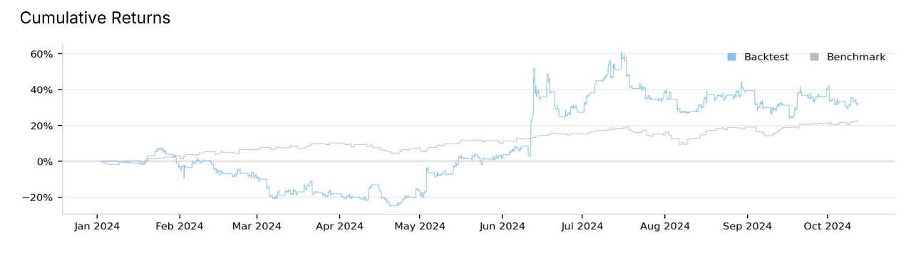
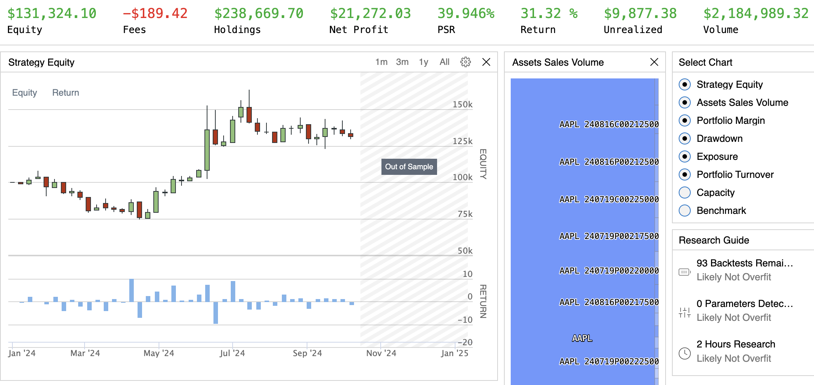
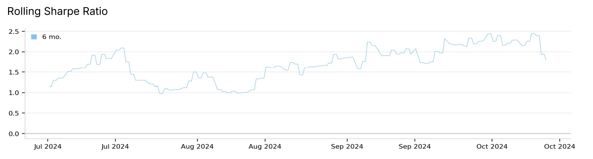
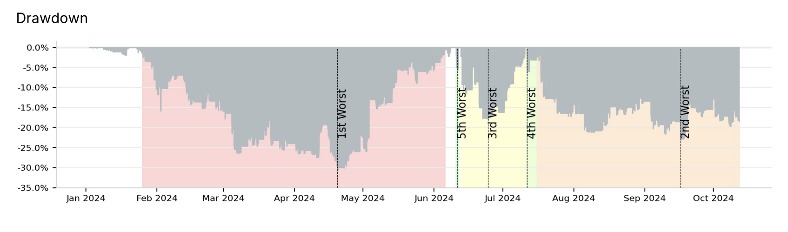
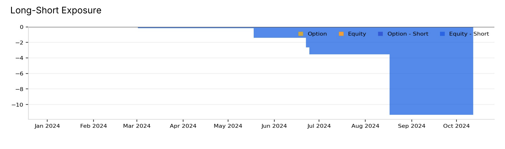

**DFIC Quant Team – Black -Scholes Volatility Straddle Algorithm**

**Overview**

This project is done by developing an options trading strategy leveraging the Black-Scholes model to identify profitable opportunities through implied volatility analysis. By constructing straddles under specific market conditions, the strategy seeks to profit from price movements or stability, depending on whether realized volatility exceeds or contracts relative to implied volatility. Assets with mispriced implied volatility (IV) can have consistent trading opportunities through straddle strategies.

**Key statistics**

**1.1.2024 to 1.1.2025 – ends around November**

Sharpe ratio – 0.785

Win Rate – 49%

Total Orders – 417

Average Win – 5.39%

Average Loss – -0.79%

Return – 31.32 %

Volume – $2,184,989.32

Alpha – 0.056

Beta – 1.807

**1.1.2020 to 1.1.2021**

Sharpe ratio – 1.953

Win Rate – 46%

Total Orders – 491

Average Win – 12.92%

Average Loss – -1.26%

Return – 138.47 %

Volume – $5,926,696.82

Alpha – 1.182

Beta – -0.363

**Performance metrics**

Charts from the back-test for 1.1.2024 to 1.1.2025 period

**Findings**

In this strategy the straddle takes away a lot of the downside swings of most stocks. The returns are great for most situations given the asset has high liquidity and high volatility. The risk is managed by the use of a straddle because it uses options as well as the Black - Scholes model regulating the implied volatility. This is shown by the strong Sharpe ratios. I think this strategy can be optimized further as the percentage where the algorithm makes trades is tied to an implied probability average that can be changed. This could potentially reduce volume and increase the strategy’s precision in identifying opportunities. The volume may be slightly high too but that is also how the algorithm yields high returns. The relatively small average loss compared to the average win suggests effective risk management tactics are in place.